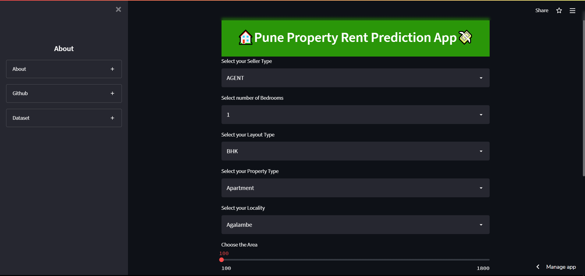

# Pune Rroperty Rent Prediction

  

- This is a machine learning based model for predicting House rents in Pune.
- I have used pipeline and only Linear regression.
- made by *Aditya Hiremath*
- References : [CampusX YT](https://www.youtube.com/watch?v=DVxkI1VmpCk&t=1948s), [Rahul Mishra(Kaggle)](https://www.kaggle.com/code/rahulmishra5/pune-house-rent-prediction-with-pipeline)
- Dataset: [Kaggle](https://www.kaggle.com/code/rahulmishra5/pune-house-rent-prediction-with-pipeline)

# Try the web app

